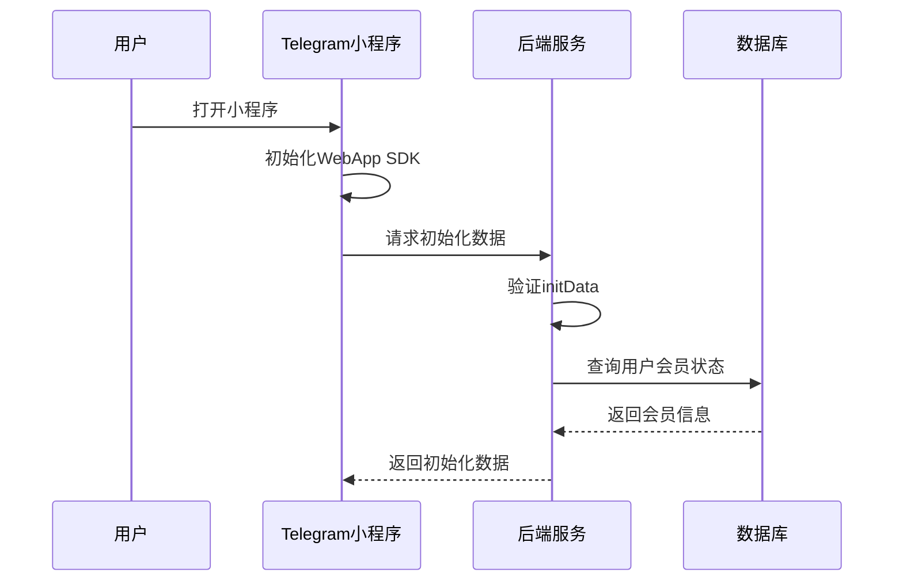
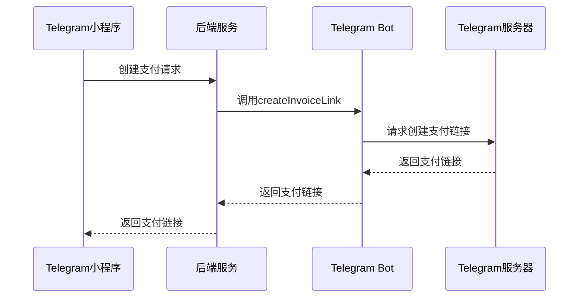
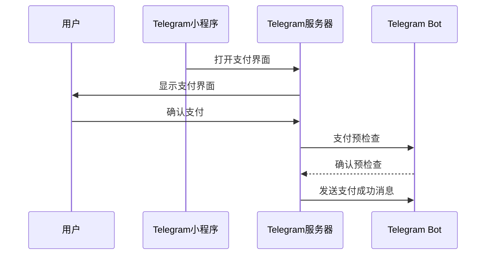
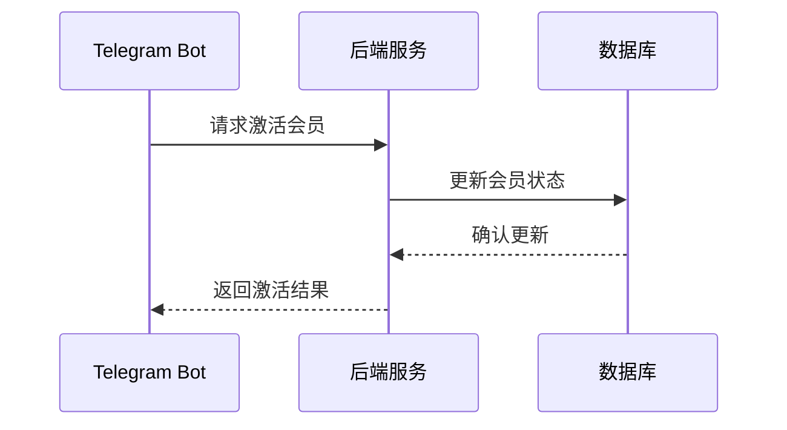
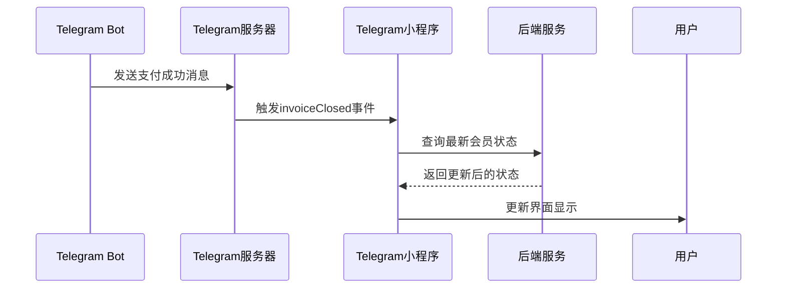

# Telegram Mini App 支付流程文档

## 目录
1. [概述](#概述)
2. [系统组件](#系统组件)
3. [详细流程](#详细流程)
4. [API 接口文档](#api-接口文档)
5. [安全考虑](#安全考虑)
6. [错误处理](#错误处理)
7. [开发指南](#开发指南)

## 概述

本文档详细描述了在 Telegram Mini App 中实现 Stars 支付功能的完整流程。该功能允许用户在小程序中购买会员，并通过 Telegram Stars 完成支付。

## 系统组件

系统包含以下主要组件：

1. **Telegram Mini App（前端）**
   - 用户界面
   - WebApp SDK 集成
   - 支付状态管理

2. **Telegram Bot**
   - 处理支付回调
   - 创建支付链接
   - 用户通知

3. **后端服务**
   - API 接口
   - 业务逻辑处理
   - 数据持久化

4. **数据库**
   - 用户信息存储
   - 会员状态管理
   - 支付记录

## 详细流程

### 1. 初始化阶段 (步骤 1-7)



#### 关键点说明：
- Mini App 启动时必须验证用户身份
- 初始化数据包含用户会员状态
- 使用 WebApp SDK 获取用户信息

### 2. 支付创建阶段 (步骤 8-14)



#### 关键点说明：
- 支付金额和商品信息在后端验证
- 使用 Bot API 创建支付链接
- 支付链接包含用户标识信息

### 3. 支付处理阶段 (步骤 15-20)



#### 关键点说明：
- 使用 WebApp.openInvoice() 打开支付界面
- Bot 必须处理预检查请求
- 支付过程由 Telegram 负责

### 4. 会员激活阶段 (步骤 21-24)



#### 关键点说明：
- 使用事务确保数据一致性
- 记录详细的支付信息
- 实现幂等性处理

### 5. 状态同步阶段 (步骤 25-31)



#### 关键点说明：
- 实时更新用户界面
- 处理支付结果回调
- 确保状态同步准确

## API 接口文档

### 1. 创建支付请求

```typescript
POST /api/create-payment

Request {
  userId: string;          // Telegram 用户 ID
  amount: number;          // 支付金额（TON）
  productName: string;     // 商品名称
  telegramPayload: string; // Telegram initData
}

Response {
  success: boolean;
  invoiceLink: string;     // Telegram 支付链接
  error?: string;
}
```

### 2. 查询会员状态

```typescript
GET /api/membership-status

Headers {
  Authorization: string;   // Bearer token
}

Response {
  status: 'active' | 'inactive';
  expiryDate?: string;
  features: string[];
  error?: string;
}
```

### 3. 激活会员

```typescript
POST /api/activate-membership

Headers {
  Authorization: string;   // API密钥
}

Request {
  userId: string;         // Telegram 用户 ID
  paymentId: string;      // 支付交易 ID
  amount: number;         // 支付金额
  currency: string;       // 货币类型
}

Response {
  success: boolean;
  membershipDetails: {
    status: string;
    expiryDate: string;
  }
  error?: string;
}
```

## 安全考虑

1. **身份验证**
   - 验证所有 Telegram initData
   - 使用 HTTPS 进行通信
   - 实现请求签名机制

2. **数据安全**
   - 敏感数据加密存储
   - 实现访问控制
   - 日志脱敏处理

3. **支付安全**
   - 验证支付回调来源
   - 金额二次确认
   - 防重放攻击

## 错误处理

1. **网络错误**
   - 实现重试机制
   - 超时处理
   - 断线重连

2. **业务错误**
   - 用户友好的错误提示
   - 详细的错误日志
   - 事务回滚

3. **状态同步**
   - 定期状态检查
   - 失败重试队列
   - 手动同步机制

## 开发指南

### 前端开发

1. **环境设置**
   ```javascript
   // 初始化 WebApp SDK
   import { WebApp } from '@twa-dev/sdk';
   WebApp.ready();
   ```

2. **支付按钮实现**
   ```javascript
   async function handlePayment() {
     try {
       const response = await createPayment();
       WebApp.openInvoice(response.invoiceLink);
     } catch (error) {
       handleError(error);
     }
   }
   ```

3. **状态监听**
   ```javascript
   WebApp.onEvent('invoiceClosed', (status) => {
     if (status === 'paid') {
       refreshMembershipStatus();
     }
   });
   ```

### 后端开发

1. **验证函数**
   ```javascript
   function verifyTelegramData(initData) {
     // 实现验证逻辑
   }
   ```

2. **会员激活**
   ```javascript
   async function activateMembership(userId, paymentInfo) {
     // 实现事务处理
   }
   ```

3. **状态管理**
   ```javascript
   async function updateMembershipStatus(userId, status) {
     // 实现状态更新
   }
   ```

### Bot 开发

1. **支付回调**
   ```javascript
   bot.on("message:successful_payment", async (ctx) => {
     // 实现支付成功处理
   });
   ```

2. **错误处理**
   ```javascript
   bot.catch((error) => {
     // 实现错误处理
   });
   ```

## 测试建议

1. **单元测试**
   - API 接口测试
   - 业务逻辑测试
   - 数据验证测试

2. **集成测试**
   - 支付流程测试
   - 状态同步测试
   - 错误恢复测试

3. **性能测试**
   - 并发处理能力
   - 响应时间测试
   - 资源使用监控

## 部署检查清单

- [ ] 配置 Telegram Bot Token
- [ ] 设置支付提供者（Stars）
- [ ] 配置 webhook URL
- [ ] 设置数据库连接
- [ ] 配置 SSL 证书
- [ ] 设置环境变量
- [ ] 配置错误监控
- [ ] 设置日志记录
- [ ] 配置备份策略
- [ ] 设置告警机制
